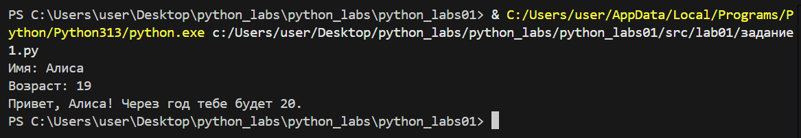
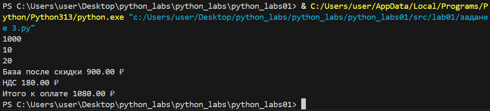
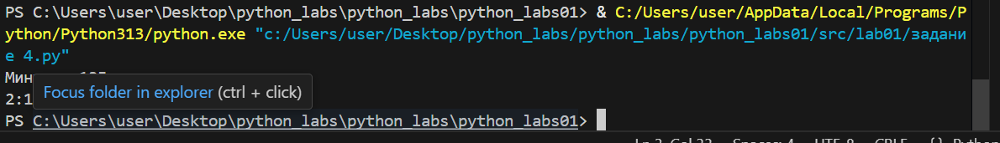
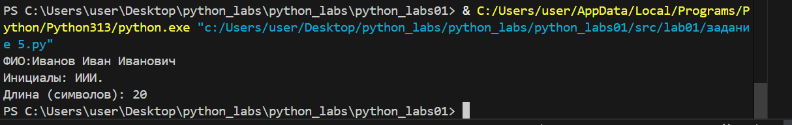
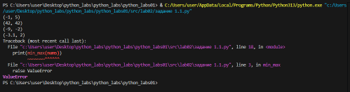
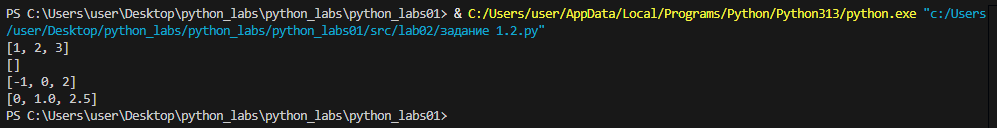
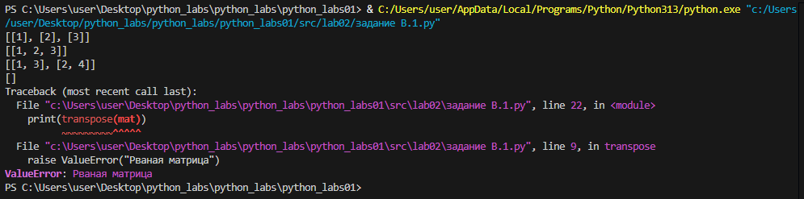

# Лабораторная работа №1
## Ввод/вывод и форматирование в Python

# Цель работы:
Освоить базовые операции ввода-вывода данных, работу с различными типами переменных и форматирование вывода в Python.

## Задание 1: Приветствие и возраст

**Файл:** `src/01_greeting.py`  

**Цель:** Работа со строками и целыми числами, конкатенация строк.

**Ввод:**
- Имя (строка)
- Возраст (целое число)

**Вывод:**


**Пример:**
Имя: Алиса
Возраст: 19
Привет, Алиса! Через год тебе будет 20.
# Задание 2: Сумма и среднее арифметическое

**Файл:** `src/02_sum_avg.py`  

**Цель:** Работа с вещественными числами, форматирование вывода.

**Ввод:**
- Два вещественных числа (поддерживаются точка и запятая)

**Вывод:**


**Пример:**
a: 3,5
b: 4.25
sum=7.75; avg=3.88   
**Задание 3**: Расчет чека со скидкой и НДС

**Файл:** `src/03_discount_vat.py`  

**Цель:** Применение математических формул, сложное форматирование вывода.

**Формулы:**
- `base = price * (1 - discount/100)`
- `vat_amount = base * (vat/100)`
- `total = base + vat_amount`

**Ввод:**
- Цена (вещественное)
- Скидка (%) (вещественное)
- НДС (%) (вещественное)

**Вывод:**


**Пример:**
price (₽): 1000
discount (%): 10
vat (%): 20
#   Задание 4: Конвертер минут в часы и минуты

**Файл:** `src/04_minutes_to_hhmm.py`  

**Цель:** Работа с целочисленным делением, форматирование времени.

**Ввод:**
- Минуты (целое число)

**Вывод:**


**Пример:**
Минуты: 135
2:15

#   Задание 5: Инициалы и длина строки


**Файл:** `src/05_initials_and_len.py`
 
**Цель:** Работа со строками, методами строк, форматирование.

**Ввод:**

 ФИО одной строкой (могут быть лишние пробелы)

**Вывод:**




**Пример:**

ФИО: Иванов Иван Иванович
Инициалы: ИИИ.
Длина (символов): 20

**Студент:** Никифорова Анастасия Сергеевна
**Группа:** [БИВТ-25-4]  
**Преподаватель:** [Жураковский К.В]
 
# Лабораторная работа №2
## Коллекции и матрицы (list/tuple/set/dict)
# Цель работы:
Освоить операции над списками, кортежами, множествами и словарями.
Научиться работать с 2D-списками (матрицами) — транспонирование, суммы по строкам/столбцам.
Аккуратно форматировать текстовые представления записей (на примере студента).

## Задание 1: arrays.py

**Файл:** `src/lab02/задание 1.1.py`  

**Цель:** Вернуть кортеж (минимум, максимум). Если список пуст — ValueError.

**Ввод в min_max:**
- [3, -1, 5, 5, 0]
- [42]
- [-5, -2, -9]
- []
- [1.5, 2, 2.0, -3.1]

**Вывод:**


**Файл:** `src/lab02/задание 1.2.py`

**Цель:** Вернуть отсортированный список уникальных значений (по возрастанию).


**Ввод в unique_sorted:**
- [3, 1, 2, 1, 3]
- []
- [-1, -1, 0, 2, 2]
- [1.0, 1, 2.5, 2.5, 0]

**Вывод:**


**Файл:** `src/lab02/задание 1.3.py`

**Цель:**«Расплющить» список списков/кортежей в один список по строкам (row-major). Если встретилась строка/элемент, который не является списком/кортежем — TypeError.


**Ввод в flatten:**
- [[1, 2], [3, 4]]
- [[1, 2], (3, 4, 5)]
- [[1], [], [2, 3]]
- [[1, 2], "ab"]

**Вывод:**


# Задание B: matrix.py

**Файл:** `src/lab02/задание B.1.py`

**Цель:** Поменять строки и столбцы местами. Пустая матрица [] → [].
Если матрица «рваная» (строки разной длины) — ValueError.
  

**Ввод в transpose:**
- [[1, 2, 3]]
- [[1], [2], [3]]
- [[1, 2], [3, 4]]
- []
- [[1, 2], [3]]

**Вывод:**


**Файл:** `src/lab02/задание B.2.py`

**Цель:** Сделать сумму по каждой строке. Требуется прямоугольность.


**Ввод в row_sums:**
- [[1, 2, 3], [4, 5, 6]]
- [[-1, 1], [10, -10]]
- [[0, 0], [0, 0]]
- [[1, 2], [3]]

**Вывод:**


**Файл:** `src/lab02/задание B.3.py`

**Цель:** сделать сумму по каждому столбцу. Требуется прямоугольность.


**Ввод в col_sums:**
- [[1, 2, 3], [4, 5, 6]]
- [[-1, 1], [10, -10]]
- [[0, 0], [0, 0]]
- [[1, 2], [3]]

**Вывод:**

#   Задание C: tuples.py

**Файл:** `src/lab02/задание C.1.py`  

**Цель:** Освоение работы с структурированными данными и форматированным выводом через кортежи.

**Ввод:**
- ("Иванов Иван Иванович", "BIVT-25", 4.6)
- ("Петров Пётр", "IKBO-12", 5.0)
- ("Петров Пётр Петрович", "IKBO-12", 5.0)
-  ("  сидорова  анна   сергеевна ", "ABB-01", 3.999)

**Вывод:**

**Студент:** Никифорова Анастасия Сергеевна
**Группа:** [БИВТ-25-4]  
**Преподаватель:** [Жураковский К.В]

# Лабораторная работа №3
## Тексты и частоты слов (словарь/множество)
# Цель работы:
Нормализовать текст, аккуратно токенизировать, посчитать частоты слов и вывести топ-N.
Связь: продолжение ЛР2 (работа со списками) и подготовка к ЛР4 (файлы) — модуль lib/text.py будем переиспользовать.

## Задание A: src/lib/text.py

**Файл:** `src/lab03/задание A.1.py`  

**Цель:** 
- Приведение к единому регистру через casefold для корректной обработки Unicode
- Унификация буквы "ё" → "е" для устранения дублирования слов
- Очистка от управляющих символов (\t, \r, \n) с заменой на пробелы
- Нормализация пробелов - схлопывание множественных пробелов в один

**Ввод в normalize:**
- "ПрИвЕт\nМИр\t"
- "ёжик, Ёлка"
- "Hello\r\nWorld"
- "  двойные   пробелы  "

**Вывод:**


**Файл:** `src/lab03/задание A.2.py`

**Цель:** 
- Выделение слов по не-буквенно-цифровым разделителям
- Сохранение дефисных конструкций как единых слов (по-настоящему)
- Включение чисел как полноценных токенов
- Игнорирование эмодзи и спецсимволов как не-слов


**Ввод в tokenize:**
- "привет мир"
- "hello,world!!!"
- "по-настоящему круто"
- "2025 год"
- "emoji 😀 не слово"
**Вывод:**


**Файл:** `src/lab03/задание A.3.py`

**Цель:**
- Подсчет встречаемости каждого уникального токена
- Возврат словаря с соответствием слово → количество вхождений
- Эффективный подсчет через оптимизированные структуры данных

**Ввод в count_freq + top_n:**
- ["a", "b", "a", "c", "b", "a"]
- ["bb", "aa", "bb", "aa", "cc"]
- ["привет", "мир", "привет", "всем", "мир", "прекрасен"]

**Вывод:**


# Задание B: matrix.py

**Файл:** `src/lab03/задание B.1.py`

**Цель:** Скрипт читает одну строку текста из stdin (или весь ввод до EOF — на ваш выбор, опишите в README), вызывает функции из lib/text.py и печатает:
- Всего слов: N
- Уникальных слов: K
- Топ-5: — по строке на запись в формате слово:кол-во (по убыванию, как в top_n).

  

**Ввод в B:**
- "Привет, мир! Привет!!!"

**Вывод:**


**Студент:** Никифорова Анастасия Сергеевна
**Группа:** [БИВТ-25-4]  
**Преподаватель:** [Жураковский К.В]
# Лабораторная работа №4
## Файлы: TXT/CSV и отчёты по текстовой статистике
# Цель работы:
 закрепить работу с файлами (чтение/запись, кодировки), автоматизировать сбор статистики по словам и выгружать её в CSV.

## Задание A:  модуль src/lab04/io_txt_csv.py

**Файл:** `src/lab04/задание А1.py`  

**Цель:** 
Реализовать (с докстрингами и типами):

1 read_text(path: str | Path, encoding: str = "utf-8") -> str

- Открыть файл на чтение в указанной кодировке и вернуть содержимое как одну строку.

- Обрабатывать ошибки: если файл не найден — поднимать FileNotFoundError (пусть падает), если кодировка не подходит — поднимать UnicodeDecodeError (пусть падает).

- НО: в докстринге опишите, как пользователь может выбрать другую кодировку (пример: encoding="cp1251").
2 write_csv(rows: list[tuple | list], path: str | Path, header: tuple[str, ...] | None = None) -> None

- Создать/перезаписать CSV с разделителем ,.
- Если передан header, записать его первой строкой.
- Проверить, что каждая строка в rows имеет одинаковую длину (иначе ValueError).

````
import sys
import os

ROOT_DIR = os.path.abspath(os.path.join(os.path.dirname(__file__), '..', '..'))
sys.path.insert(0, ROOT_DIR)

sys.path.append(os.path.join(os.path.dirname(__file__), '..'))


from lib.text import normalize, tokenize, count_freq, top_n

from pathlib import Path
import csv
from typing import Iterable, Sequence
from collections import Counter


def read_text(path: str | Path, encoding: str = "utf-8") -> str:
    p = Path(path)
    return p.read_text(encoding=encoding)


def write_csv(rows: Iterable[Sequence], path: str | Path,
              header: tuple[str, ...] | None = None) -> None:
    p = Path(path)
    rows = list(rows)
    with p.open("w", newline="", encoding="utf-8") as f:
        w = csv.writer(f)
        if header is not None:
            w.writerow(header)
        for r in rows:
            w.writerow(r)


def frequencies_from_text(text: str) -> dict[str, int]:
    tokens = tokenize(normalize(text))
    return Counter(tokens) 


def sorted_word_counts(freq: dict[str, int]) -> list[tuple[str, int]]:
    return sorted(freq.items(), key=lambda kv: (-kv[1], kv[0]))


txt = read_text("data/input.txt") 
data=[i for i in top_n(count_freq(tokenize(normalize(txt))),n=5)]
write_csv(
    header=("word","count"),
    rows=data,
    path = "data/check.csv" ,
)

````
**Вывод 1:**


**Вывод 2:**


# Задание B: скрипт src/lab04/text_report.py

**Файл:** `src/lab04/задание В1.py`

**Цель:** Написать скрипт, который:

1. Читает один входной файл data/input.txt (путь можно захардкодить или принять параметром командной строки — опишите в README).
2. Нормализует текст (lib/text.py), токенизирует и считает частоты слов.
3. Сохраняет data/report.csv c колонками: word,count, отсортированными: count ↓, слово ↑ (при равенстве).
4. В консоль печатает краткое резюме:
- Всего слов: <N>
- Уникальных слов: <K>
- Топ-5: (список из top_n из ЛР3)

````
import sys
import os
from pathlib import Path

ROOT_DIR = os.path.abspath(os.path.join(os.path.dirname(__file__), '..', '..'))
sys.path.insert(0, ROOT_DIR)

sys.path.append(os.path.join(os.path.dirname(__file__), '..'))

from lib.text import normalize, tokenize, count_freq, top_n

from lab04.io_txt_csv import read_text, write_csv

PROJECT_ROOT = Path(__file__).parent.parent.parent


input_path = PROJECT_ROOT / "data" / "input.txt"
output_path = PROJECT_ROOT / "data" / "report.csv"
p = read_text(input_path)
norm_p=normalize(p)
tokens=tokenize(norm_p)
count_word=count_freq(tokens)
top=top_n(count_freq(tokenize(normalize(p))))

write_csv(top, output_path, ["word", "count"])

print("Всего слов:", len(tokens))
print("Уникальных слов:", len(count_word))
print("Топ-5:")
for x,y in top[:5]:
    print(f'{x}:{y}')
````


**Вывод:**

**Студент:** Никифорова Анастасия Сергеевна
**Группа:** [БИВТ-25-4]  
**Преподаватель:** [Жураковский К.В]


# Лабораторная работа №5
## Задание A (csv_xlsx.py)

```Python
import json
import csv
from pathlib import Path

def json_to_csv(json_path: str, csv_path: str) -> None:
    import json
import csv
from pathlib import Path

def json_to_csv(json_path: str, csv_path: str) -> None:
    if Path(json_path).is_absolute():
        raise ValueError("путь к JSON должен быть относительным")
    if Path(csv_path).is_absolute():
        raise ValueError("путь к CSV должен быть относительным")
    
    if not json_path.lower().endswith('.json'):
        raise ValueError("нэ JSON")
    if not csv_path.lower().endswith('.csv'):
        raise ValueError("нэ CSV")
    
    if not Path(json_path).exists():
        raise FileNotFoundError(f"файл не найден: {json_path}")
    
    with open(json_path, 'r', encoding='utf-8') as f:
        data = json.load(f)
    
    if not data:
        raise ValueError("пустой JSON")
    if not isinstance(data, list):
        raise ValueError("JSON должен быть списком")
    if not all(isinstance(item, dict) for item in data):
        raise ValueError("все элементы должны быть словарями")
    
    fields = sorted(data[0].keys())
    
    Path(csv_path).parent.mkdir(parents=True, exist_ok=True)
    with open(csv_path, 'w', newline='', encoding='utf-8') as f:
        writer = csv.DictWriter(f, fieldnames=fields)
        writer.writeheader()
        for row in data:
            complete_row = {field: str(row.get(field, '')) for field in fields}
            writer.writerow(complete_row)

def csv_to_json(csv_path: str, json_path: str) -> None:
    if not csv_path.lower().endswith('.csv'):
        raise ValueError("нэ CSV")
    if not json_path.lower().endswith('.json'):
        raise ValueError("нэ JSON")
    
    if not Path(csv_path).exists():
        raise FileNotFoundError(f"файл не найден: {csv_path}")
    
    with open(csv_path, 'r', encoding='utf-8') as f:
        data = list(csv.DictReader(f))
    
    if not data:
        raise ValueError("пустой CSV")
    
    Path(json_path).parent.mkdir(parents=True, exist_ok=True)
    with open(json_path, 'w', encoding='utf-8') as f:
        json.dump(data, f, ensure_ascii=False, indent=2)

if __name__ == "__main__":
    Path("data/out").mkdir(parents=True, exist_ok=True)
    
    json_to_csv("data/samples/people.json", "data/out/people_from_json.csv")
    csv_to_json("data/samples/people.csv", "data/out/people_from_csv.json")
```
.png)
.png)
.png)
.png)

## Задание B (json_csv.py)

``` py
import csv
from pathlib import Path
from openpyxl import Workbook
from openpyxl.utils import get_column_letter

def csv_to_xlsx(csv_path: str, xlsx_path: str) -> None:
    if Path(csv_path).is_absolute() or Path(xlsx_path).is_absolute():
        raise ValueError("пути должны быть относительными")
    if not csv_path.endswith('.csv') or not xlsx_path.endswith('.xlsx'):
        raise ValueError("неверные расширения файлов")
    if not Path(csv_path).exists():
        raise FileNotFoundError(f"файл не найден: {csv_path}")
    
    with open(csv_path, "r", encoding="utf-8") as f:
        rows = list(csv.reader(f))
    
    if not rows or not any(rows[0]):
        raise ValueError("пустой CSV или нет заголовка")
    
    wb = Workbook()
    ws = wb.active
    ws.title = "Sheet1"
    
    max_lengths = []
    for row in rows:
        ws.append(row)
        for i, value in enumerate(row):
            if i >= len(max_lengths):
                max_lengths.append(0)
            max_lengths[i] = max(max_lengths[i], len(str(value or "")))
    
    for i, length in enumerate(max_lengths, 1):
        ws.column_dimensions[get_column_letter(i)].width = max(length + 2, 8)
    
    Path(xlsx_path).parent.mkdir(parents=True, exist_ok=True)
    wb.save(xlsx_path)

if __name__ == "__main__":
    Path("data/out").mkdir(parents=True, exist_ok=True)
    csv_to_xlsx("data/samples/people.csv", "data/out/people.xlsx")
```
.png)
.png)
**Студент:** Никифорова Анастасия Сергеевна
**Группа:** [БИВТ-25-4]  
**Преподаватель:** [Жураковский К.В]