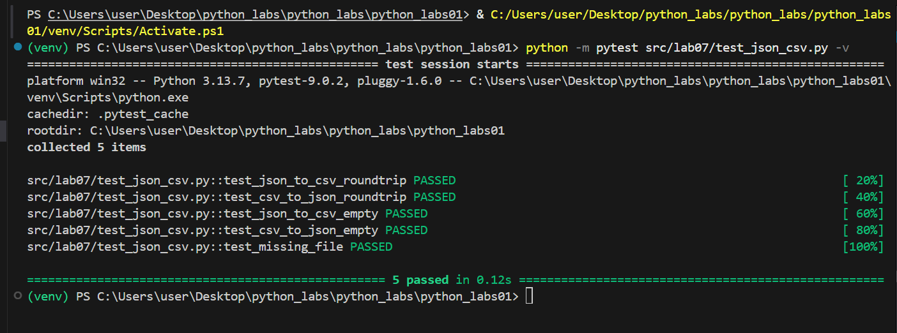
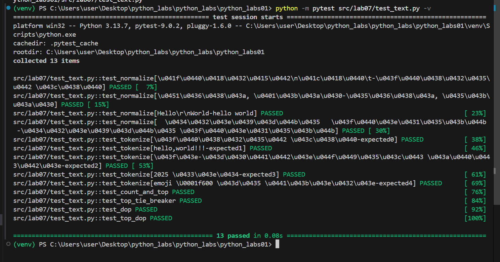
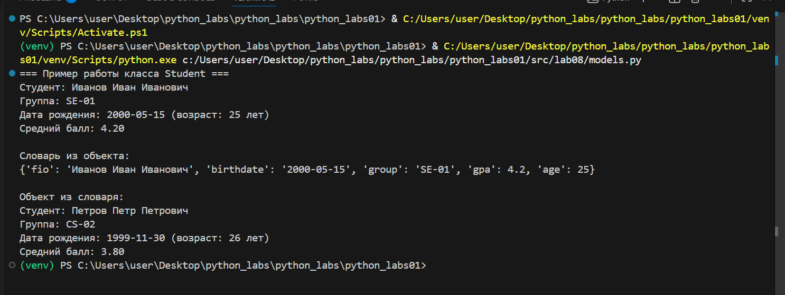
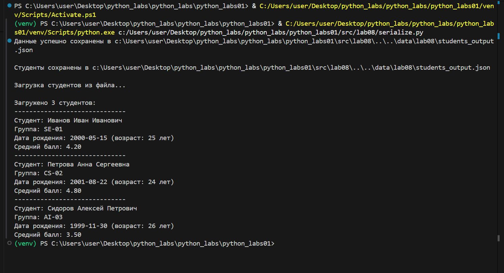

# Лабораторная работа №1
## Ввод/вывод и форматирование в Python

# Цель работы:
Освоить базовые операции ввода-вывода данных, работу с различными типами переменных и форматирование вывода в Python.

## Задание 1: Приветствие и возраст

**Файл:** `src/01_greeting.py`  

**Цель:** Работа со строками и целыми числами, конкатенация строк.

**Ввод:**
- Имя (строка)
- Возраст (целое число)

**Вывод:**


**Пример:**
Имя: Алиса
Возраст: 19
Привет, Алиса! Через год тебе будет 20.
# Задание 2: Сумма и среднее арифметическое

**Файл:** `src/02_sum_avg.py`  

**Цель:** Работа с вещественными числами, форматирование вывода.

**Ввод:**
- Два вещественных числа (поддерживаются точка и запятая)

**Вывод:**


**Пример:**
a: 3,5
b: 4.25
sum=7.75; avg=3.88   
**Задание 3**: Расчет чека со скидкой и НДС

**Файл:** `src/03_discount_vat.py`  

**Цель:** Применение математических формул, сложное форматирование вывода.

**Формулы:**
- `base = price * (1 - discount/100)`
- `vat_amount = base * (vat/100)`
- `total = base + vat_amount`

**Ввод:**
- Цена (вещественное)
- Скидка (%) (вещественное)
- НДС (%) (вещественное)

**Вывод:**


**Пример:**
price (₽): 1000
discount (%): 10
vat (%): 20
#   Задание 4: Конвертер минут в часы и минуты

**Файл:** `src/04_minutes_to_hhmm.py`  

**Цель:** Работа с целочисленным делением, форматирование времени.

**Ввод:**
- Минуты (целое число)

**Вывод:**


**Пример:**
Минуты: 135
2:15

#   Задание 5: Инициалы и длина строки


**Файл:** `src/05_initials_and_len.py`
 
**Цель:** Работа со строками, методами строк, форматирование.

**Ввод:**

 ФИО одной строкой (могут быть лишние пробелы)

**Вывод:**


**Пример:**

ФИО: Иванов Иван Иванович
Инициалы: ИИИ.
Длина (символов): 20

**Студент:** Никифорова Анастасия Сергеевна
**Группа:** [БИВТ-25-4]  
**Преподаватель:** [Жураковский К.В]
 
# Лабораторная работа №2
## Коллекции и матрицы (list/tuple/set/dict)
# Цель работы:
Освоить операции над списками, кортежами, множествами и словарями.
Научиться работать с 2D-списками (матрицами) — транспонирование, суммы по строкам/столбцам.
Аккуратно форматировать текстовые представления записей (на примере студента).

## Задание 1: arrays.py

**Файл:** `src/lab02/задание 1.1.py`  

**Цель:** Вернуть кортеж (минимум, максимум). Если список пуст — ValueError.

**Ввод в min_max:**
- [3, -1, 5, 5, 0]
- [42]
- [-5, -2, -9]
- []
- [1.5, 2, 2.0, -3.1]

**Вывод:**


**Файл:** `src/lab02/задание 1.2.py`

**Цель:** Вернуть отсортированный список уникальных значений (по возрастанию).


**Ввод в unique_sorted:**
- [3, 1, 2, 1, 3]
- []
- [-1, -1, 0, 2, 2]
- [1.0, 1, 2.5, 2.5, 0]

**Вывод:**


**Файл:** `src/lab02/задание 1.3.py`

**Цель:**«Расплющить» список списков/кортежей в один список по строкам (row-major). Если встретилась строка/элемент, который не является списком/кортежем — TypeError.


**Ввод в flatten:**
- [[1, 2], [3, 4]]
- [[1, 2], (3, 4, 5)]
- [[1], [], [2, 3]]
- [[1, 2], "ab"]

**Вывод:**


# Задание B: matrix.py

**Файл:** `src/lab02/задание B.1.py`

**Цель:** Поменять строки и столбцы местами. Пустая матрица [] → [].
Если матрица «рваная» (строки разной длины) — ValueError.
  

**Ввод в transpose:**
- [[1, 2, 3]]
- [[1], [2], [3]]
- [[1, 2], [3, 4]]
- []
- [[1, 2], [3]]

**Вывод:**


**Файл:** `src/lab02/задание B.2.py`

**Цель:** Сделать сумму по каждой строке. Требуется прямоугольность.


**Ввод в row_sums:**
- [[1, 2, 3], [4, 5, 6]]
- [[-1, 1], [10, -10]]
- [[0, 0], [0, 0]]
- [[1, 2], [3]]

**Вывод:**


**Файл:** `src/lab02/задание B.3.py`

**Цель:** сделать сумму по каждому столбцу. Требуется прямоугольность.


**Ввод в col_sums:**
- [[1, 2, 3], [4, 5, 6]]
- [[-1, 1], [10, -10]]
- [[0, 0], [0, 0]]
- [[1, 2], [3]]

**Вывод:**

#   Задание C: tuples.py

**Файл:** `src/lab02/задание C.1.py`  

**Цель:** Освоение работы с структурированными данными и форматированным выводом через кортежи.

**Ввод:**
- ("Иванов Иван Иванович", "BIVT-25", 4.6)
- ("Петров Пётр", "IKBO-12", 5.0)
- ("Петров Пётр Петрович", "IKBO-12", 5.0)
-  ("  сидорова  анна   сергеевна ", "ABB-01", 3.999)

**Вывод:**

**Студент:** Никифорова Анастасия Сергеевна
**Группа:** [БИВТ-25-4]  
**Преподаватель:** [Жураковский К.В]

# Лабораторная работа №3
## Тексты и частоты слов (словарь/множество)
# Цель работы:
Нормализовать текст, аккуратно токенизировать, посчитать частоты слов и вывести топ-N.
Связь: продолжение ЛР2 (работа со списками) и подготовка к ЛР4 (файлы) — модуль lib/text.py будем переиспользовать.

## Задание A: src/lib/text.py

**Файл:** `src/lab03/задание A.1.py`  

**Цель:** 
- Приведение к единому регистру через casefold для корректной обработки Unicode
- Унификация буквы "ё" → "е" для устранения дублирования слов
- Очистка от управляющих символов (\t, \r, \n) с заменой на пробелы
- Нормализация пробелов - схлопывание множественных пробелов в один

**Ввод в normalize:**
- "ПрИвЕт\nМИр\t"
- "ёжик, Ёлка"
- "Hello\r\nWorld"
- "  двойные   пробелы  "

**Вывод:**


**Файл:** `src/lab03/задание A.2.py`

**Цель:** 
- Выделение слов по не-буквенно-цифровым разделителям
- Сохранение дефисных конструкций как единых слов (по-настоящему)
- Включение чисел как полноценных токенов
- Игнорирование эмодзи и спецсимволов как не-слов


**Ввод в tokenize:**
- "привет мир"
- "hello,world!!!"
- "по-настоящему круто"
- "2025 год"
- "emoji 😀 не слово"
**Вывод:**


**Файл:** `src/lab03/задание A.3.py`

**Цель:**
- Подсчет встречаемости каждого уникального токена
- Возврат словаря с соответствием слово → количество вхождений
- Эффективный подсчет через оптимизированные структуры данных

**Ввод в count_freq + top_n:**
- ["a", "b", "a", "c", "b", "a"]
- ["bb", "aa", "bb", "aa", "cc"]
- ["привет", "мир", "привет", "всем", "мир", "прекрасен"]

**Вывод:**


# Задание B: matrix.py

**Файл:** `src/lab03/задание B.1.py`

**Цель:** Скрипт читает одну строку текста из stdin (или весь ввод до EOF — на ваш выбор, опишите в README), вызывает функции из lib/text.py и печатает:
- Всего слов: N
- Уникальных слов: K
- Топ-5: — по строке на запись в формате слово:кол-во (по убыванию, как в top_n).

  

**Ввод в B:**
- "Привет, мир! Привет!!!"

**Вывод:**


**Студент:** Никифорова Анастасия Сергеевна
**Группа:** [БИВТ-25-4]  
**Преподаватель:** [Жураковский К.В]
# Лабораторная работа №4
## Файлы: TXT/CSV и отчёты по текстовой статистике
# Цель работы:
 закрепить работу с файлами (чтение/запись, кодировки), автоматизировать сбор статистики по словам и выгружать её в CSV.

## Задание A:  модуль src/lab04/io_txt_csv.py

**Файл:** `src/lab04/задание А1.py`  

**Цель:** 
Реализовать (с докстрингами и типами):

1 read_text(path: str | Path, encoding: str = "utf-8") -> str

- Открыть файл на чтение в указанной кодировке и вернуть содержимое как одну строку.

- Обрабатывать ошибки: если файл не найден — поднимать FileNotFoundError (пусть падает), если кодировка не подходит — поднимать UnicodeDecodeError (пусть падает).

- НО: в докстринге опишите, как пользователь может выбрать другую кодировку (пример: encoding="cp1251").
2 write_csv(rows: list[tuple | list], path: str | Path, header: tuple[str, ...] | None = None) -> None

- Создать/перезаписать CSV с разделителем ,.
- Если передан header, записать его первой строкой.
- Проверить, что каждая строка в rows имеет одинаковую длину (иначе ValueError).

````
import sys
import os

ROOT_DIR = os.path.abspath(os.path.join(os.path.dirname(__file__), '..', '..'))
sys.path.insert(0, ROOT_DIR)

sys.path.append(os.path.join(os.path.dirname(__file__), '..'))


from lib.text import normalize, tokenize, count_freq, top_n

from pathlib import Path
import csv
from typing import Iterable, Sequence
from collections import Counter


def read_text(path: str | Path, encoding: str = "utf-8") -> str:
    p = Path(path)
    return p.read_text(encoding=encoding)


def write_csv(rows: Iterable[Sequence], path: str | Path,
              header: tuple[str, ...] | None = None) -> None:
    p = Path(path)
    rows = list(rows)
    with p.open("w", newline="", encoding="utf-8") as f:
        w = csv.writer(f)
        if header is not None:
            w.writerow(header)
        for r in rows:
            w.writerow(r)


def frequencies_from_text(text: str) -> dict[str, int]:
    tokens = tokenize(normalize(text))
    return Counter(tokens) 


def sorted_word_counts(freq: dict[str, int]) -> list[tuple[str, int]]:
    return sorted(freq.items(), key=lambda kv: (-kv[1], kv[0]))


txt = read_text("data/input.txt") 
data=[i for i in top_n(count_freq(tokenize(normalize(txt))),n=5)]
write_csv(
    header=("word","count"),
    rows=data,
    path = "data/check.csv" ,
)

````
**Вывод 1:**


**Вывод 2:**


# Задание B: скрипт src/lab04/text_report.py

**Файл:** `src/lab04/задание В1.py`

**Цель:** Написать скрипт, который:

1. Читает один входной файл data/input.txt (путь можно захардкодить или принять параметром командной строки — опишите в README).
2. Нормализует текст (lib/text.py), токенизирует и считает частоты слов.
3. Сохраняет data/report.csv c колонками: word,count, отсортированными: count ↓, слово ↑ (при равенстве).
4. В консоль печатает краткое резюме:
- Всего слов: <N>
- Уникальных слов: <K>
- Топ-5: (список из top_n из ЛР3)

````
import sys
import os
from pathlib import Path

ROOT_DIR = os.path.abspath(os.path.join(os.path.dirname(__file__), '..', '..'))
sys.path.insert(0, ROOT_DIR)

sys.path.append(os.path.join(os.path.dirname(__file__), '..'))

from lib.text import normalize, tokenize, count_freq, top_n

from lab04.io_txt_csv import read_text, write_csv

PROJECT_ROOT = Path(__file__).parent.parent.parent


input_path = PROJECT_ROOT / "data" / "input.txt"
output_path = PROJECT_ROOT / "data" / "report.csv"
p = read_text(input_path)
norm_p=normalize(p)
tokens=tokenize(norm_p)
count_word=count_freq(tokens)
top=top_n(count_freq(tokenize(normalize(p))))

write_csv(top, output_path, ["word", "count"])

print("Всего слов:", len(tokens))
print("Уникальных слов:", len(count_word))
print("Топ-5:")
for x,y in top[:5]:
    print(f'{x}:{y}')
````


**Вывод:**

**Студент:** Никифорова Анастасия Сергеевна
**Группа:** [БИВТ-25-4]  
**Преподаватель:** [Жураковский К.В]


# Лабораторная работа №5
## Задание A (csv_xlsx.py)

```Python
import json
import csv
from pathlib import Path

def json_to_csv(json_path: str, csv_path: str) -> None:
    import json
import csv
from pathlib import Path

def json_to_csv(json_path: str, csv_path: str) -> None:
    if Path(json_path).is_absolute():
        raise ValueError("путь к JSON должен быть относительным")
    if Path(csv_path).is_absolute():
        raise ValueError("путь к CSV должен быть относительным")
    
    if not json_path.lower().endswith('.json'):
        raise ValueError("нэ JSON")
    if not csv_path.lower().endswith('.csv'):
        raise ValueError("нэ CSV")
    
    if not Path(json_path).exists():
        raise FileNotFoundError(f"файл не найден: {json_path}")
    
    with open(json_path, 'r', encoding='utf-8') as f:
        data = json.load(f)
    
    if not data:
        raise ValueError("пустой JSON")
    if not isinstance(data, list):
        raise ValueError("JSON должен быть списком")
    if not all(isinstance(item, dict) for item in data):
        raise ValueError("все элементы должны быть словарями")
    
    fields = sorted(data[0].keys())
    
    Path(csv_path).parent.mkdir(parents=True, exist_ok=True)
    with open(csv_path, 'w', newline='', encoding='utf-8') as f:
        writer = csv.DictWriter(f, fieldnames=fields)
        writer.writeheader()
        for row in data:
            complete_row = {field: str(row.get(field, '')) for field in fields}
            writer.writerow(complete_row)

def csv_to_json(csv_path: str, json_path: str) -> None:
    if not csv_path.lower().endswith('.csv'):
        raise ValueError("нэ CSV")
    if not json_path.lower().endswith('.json'):
        raise ValueError("нэ JSON")
    
    if not Path(csv_path).exists():
        raise FileNotFoundError(f"файл не найден: {csv_path}")
    
    with open(csv_path, 'r', encoding='utf-8') as f:
        data = list(csv.DictReader(f))
    
    if not data:
        raise ValueError("пустой CSV")
    
    Path(json_path).parent.mkdir(parents=True, exist_ok=True)
    with open(json_path, 'w', encoding='utf-8') as f:
        json.dump(data, f, ensure_ascii=False, indent=2)

if __name__ == "__main__":
    Path("data/out").mkdir(parents=True, exist_ok=True)
    
    json_to_csv("data/samples/people.json", "data/out/people_from_json.csv")
    csv_to_json("data/samples/people.csv", "data/out/people_from_csv.json")
```
.png)
.png)
.png)
.png)

## Задание B (json_csv.py)

``` py
import csv
from pathlib import Path
from openpyxl import Workbook
from openpyxl.utils import get_column_letter

def csv_to_xlsx(csv_path: str, xlsx_path: str) -> None:
    if Path(csv_path).is_absolute() or Path(xlsx_path).is_absolute():
        raise ValueError("пути должны быть относительными")
    if not csv_path.endswith('.csv') or not xlsx_path.endswith('.xlsx'):
        raise ValueError("неверные расширения файлов")
    if not Path(csv_path).exists():
        raise FileNotFoundError(f"файл не найден: {csv_path}")
    
    with open(csv_path, "r", encoding="utf-8") as f:
        rows = list(csv.reader(f))
    
    if not rows or not any(rows[0]):
        raise ValueError("пустой CSV или нет заголовка")
    
    wb = Workbook()
    ws = wb.active
    ws.title = "Sheet1"
    
    max_lengths = []
    for row in rows:
        ws.append(row)
        for i, value in enumerate(row):
            if i >= len(max_lengths):
                max_lengths.append(0)
            max_lengths[i] = max(max_lengths[i], len(str(value or "")))
    
    for i, length in enumerate(max_lengths, 1):
        ws.column_dimensions[get_column_letter(i)].width = max(length + 2, 8)
    
    Path(xlsx_path).parent.mkdir(parents=True, exist_ok=True)
    wb.save(xlsx_path)

if __name__ == "__main__":
    Path("data/out").mkdir(parents=True, exist_ok=True)
    csv_to_xlsx("data/samples/people.csv", "data/out/people.xlsx")
```
.png)
.png)
**Студент:** Никифорова Анастасия Сергеевна
**Группа:** [БИВТ-25-4]  
**Преподаватель:** [Жураковский К.В]
# Лабораторная работа №6
## Задание A (cli_convert.py)

```Python
import argparse
from pathlib import Path
import sys
import json
import csv
import pandas as pd


def json_to_csv(input_file: str, output_file: str):
    try:
        with open(input_file, 'r', encoding='utf-8') as f:
            data = json.load(f)
        
        if not isinstance(data, list):
            data = [data]
        
        if not data:
            raise ValueError("JSON файл пустой")
        
        fieldnames = list(data[0].keys())
        
        with open(output_file, 'w', newline='', encoding='utf-8') as f:
            writer = csv.DictWriter(f, fieldnames=fieldnames)
            writer.writeheader()
            writer.writerows(data)
        
        print(f"Конвертация завершена: {input_file} → {output_file}")
        
    except Exception as e:
        sys.stderr.write(f"Ошибка конвертации JSON→CSV: {e}\n")
        sys.exit(1)


def csv_to_json(input_file: str, output_file: str, indent: int = 2):
    try:
        data = []
        with open(input_file, 'r', encoding='utf-8') as f:
            reader = csv.DictReader(f)
            for row in reader:
                data.append(row)
        
        with open(output_file, 'w', encoding='utf-8') as f:
            json.dump(data, f, ensure_ascii=False, indent=indent)
        
        print(f"Конвертация завершена: {input_file} → {output_file}")
        
    except Exception as e:
        sys.stderr.write(f"Ошибка конвертации CSV→JSON: {e}\n")
        sys.exit(1)


def csv_to_xlsx(input_file: str, output_file: str, sheet_name: str = "Sheet1"):
    try:
        df = pd.read_csv(input_file)
        df.to_excel(output_file, index=False, sheet_name=sheet_name)
        
        print(f"Конвертация завершена: {input_file} → {output_file}")
        
    except Exception as e:
        sys.stderr.write(f"Ошибка конвертации CSV→XLSX: {e}\n")
        sys.exit(1)


def main():
    parser = argparse.ArgumentParser(
        description="Конвертер JSON↔CSV, CSV→XLSX",
        formatter_class=argparse.RawDescriptionHelpFormatter
    )
    
    subparsers = parser.add_subparsers(
        dest="command",
        title="доступные команды",
        metavar=""
    )
    subparsers.required = True
    
    json2csv_parser = subparsers.add_parser(
        "json2csv",
        help="Конвертировать JSON в CSV",
        description="Преобразует JSON файл в CSV формат"
    )
    json2csv_parser.add_argument(
        "--in",
        dest="input",
        required=True,
        help="Путь к входному JSON"
    )
    json2csv_parser.add_argument(
        "--out",
        dest="output",
        required=True,
        help="Путь к выходному CSV"
    )
    
    csv2json_parser = subparsers.add_parser(
        "csv2json",
        help="Конвертировать CSV в JSON",
        description="Преобразует CSV файл в JSON формат"
    )
    csv2json_parser.add_argument(
        "--in",
        dest="input",
        required=True,
        help="Путь к входному CSV"
    )
    csv2json_parser.add_argument(
        "--out",
        dest="output",
        required=True,
        help="Путь к выходному JSON"
    )
    csv2json_parser.add_argument(
        "--indent",
        type=int,
        default=2,
        help="Отступ в JSON файле (по умолчанию: 2)"
    )
    
    csv2xlsx_parser = subparsers.add_parser(
        "csv2xlsx",
        help="Конвертировать CSV в XLSX",
        description="Преобразует CSV файл в Excel формат"
    )
    csv2xlsx_parser.add_argument(
        "--in",
        dest="input",
        required=True,
        help="Путь к входному CSV"
    )
    csv2xlsx_parser.add_argument(
        "--out",
        dest="output",
        required=True,
        help="Путь к выходному XLSX"
    )
    csv2xlsx_parser.add_argument(
        "--sheet",
        default="Sheet1",
        help="Название листа в Excel (по умолчанию: Sheet1)"
    )
    
    args = parser.parse_args()
    
    if not Path(args.input).exists():
        sys.stderr.write(f"Ошибка: входной файл '{args.input}' не найден\n")
        sys.exit(1)
    
    if args.command == "json2csv":
        json_to_csv(args.input, args.output)
    elif args.command == "csv2json":
        csv_to_json(args.input, args.output, getattr(args, 'indent', 2))
    elif args.command == "csv2xlsx":
        csv_to_xlsx(args.input, args.output, getattr(args, 'sheet', 'Sheet1'))


if __name__ == "__main__":
    main()
```
01.png)
02.png)
03.png)

## Задание B (cli_text.py)

``` py
import argparse
from pathlib import Path
import re
from collections import Counter

def normalize(text):
    text = text.lower()
    text = re.sub(r'\s+', ' ', text)
    return text.strip()

def tokenize(text):
    return re.findall(r'\b[a-zа-яё0-9]+\b', text, re.IGNORECASE)

def count_freq(words):
    freq = {}
    for word in words:
        freq[word] = freq.get(word, 0) + 1
    return freq

def top_n(freq, n=5):
    sorted_items = sorted(freq.items(), key=lambda x: (-x[1], x[0]))
    return sorted_items[:n]


def main():
    parser = argparse.ArgumentParser(description="CLI-утилиты лабораторной №6")

    subparsers = parser.add_subparsers(dest="command", help="Доступные команды", required=True)

    stats_parser = subparsers.add_parser("stats", help="Частоты слов в тексте")
    stats_parser.add_argument("--input", required=True, help="Входной текстовый файл")
    stats_parser.add_argument(
        "--top",
        type=int,
        default=5,
        help="Количество топовых слов (по умолчанию: 5)",
    )
    
    cat_parser = subparsers.add_parser("cat", help="Вывод содержимого файла")
    cat_parser.add_argument("--input", required=True, help="Путь к входному файлу")
    cat_parser.add_argument("-n", action="store_true", help="Нумеровать строки")

    args = parser.parse_args()

    if args.command == "cat":
        file = Path(args.input)
        if not file.exists():
            parser.error(f"Файл '{args.input}' не найден")
        
        with open(file, "r", encoding="utf-8") as f:
            number = 1
            for row in f:
                row = row.rstrip("\n")
                if args.n:  
                    print(f"{number}: {row}")
                    number += 1
                else:
                    print(row)

    elif args.command == "stats":
        file = Path(args.input)
        if not file.exists():
            parser.error(f"Файл '{args.input}' не найден")
        
        with open(file, "r", encoding="utf-8") as f:
            data = f.read()
        
        normalized = normalize(data)
        tokens = tokenize(normalized)
        freq = count_freq(tokens)
        top = top_n(freq, n=args.top)
        print(f"Топ {args.top} слов:")
        for i, (word, count) in enumerate(top, 1):
            print(f"{i}. {word} - {count}")


if __name__ == "__main__":
    main()
```
01.png)
02.png)
03.png)
**Студент:** Никифорова Анастасия Сергеевна
**Группа:** [БИВТ-25-4]  
**Преподаватель:** [Жураковский К.В]
# Лабораторная работа №7
## Задание A (test_json_csv)
```py
import json, csv
from pathlib import Path
import pytest
import os
import sys

sys.path.insert(0, os.path.abspath(os.path.join(os.path.dirname(__file__), '..', '..')))

from .csv_json import json_to_csv, csv_to_json


def write_json(path: Path, obj):
    path.write_text(json.dumps(obj, ensure_ascii=False, indent=2), encoding="utf-8")


def read_csv_rows(path: Path):
    with path.open(encoding="utf-8") as f:
        return list(csv.DictReader(f))


def test_json_to_csv_roundtrip(tmp_path: Path):
    src = tmp_path / "people.json"
    dst = tmp_path / "people.csv"
    data = [{"name": "Alice", "age": 22}, {"name": "Bob", "age": 25}]
    write_json(src, data)

    json_to_csv(str(src), str(dst))
    rows = read_csv_rows(dst)
    assert len(rows) == 2
    assert set(rows[0]) >= {"name", "age"}


def test_csv_to_json_roundtrip(tmp_path: Path):
    src = tmp_path / "people.csv"
    dst = tmp_path / "people.json"
    src.write_text("name,age\nAlice,22\nBob,25\n", encoding="utf-8")

    csv_to_json(str(src), str(dst))
    obj = json.loads(dst.read_text(encoding="utf-8"))
    assert isinstance(obj, list) and len(obj) == 2
    assert set(obj[0]) == {"name", "age"}


def test_json_to_csv_empty(tmp_path: Path):
    src = tmp_path / "empty.json"
    dst = tmp_path / "empty.csv"
    src.write_text("[]", encoding="utf-8")

    try:
        json_to_csv(str(src), str(dst))
        if dst.exists():
            pass
    except (ValueError, IndexError):
        pass


def test_csv_to_json_empty(tmp_path: Path):
    src = tmp_path / "empty.csv"
    dst = tmp_path / "empty.json"
    src.write_text("", encoding="utf-8")

    try:
        csv_to_json(str(src), str(dst))
        if dst.exists():
            pass
    except (ValueError, Exception):
        pass


def test_missing_file(tmp_path: Path):
    try:
        csv_to_json("nope.csv", str(tmp_path / "out.json"))
        if (tmp_path / "out.json").exists():
            pass
    except FileNotFoundError:
        pass
```

## Задание В (test_text)
```py
import pytest
import os
import sys

sys.path.insert(0, os.path.abspath(os.path.join(os.path.dirname(__file__), '..', '..')))

from src.lib.text import count_freq, normalize, tokenize, top_n

@pytest.mark.parametrize(
    "src,expected",
    [
        ("ПрИвЕт\nМИр\t", "привет мир"),
        ("ёжик, Ёлка", "ежик, елка"),
        ("Hello\r\nWorld", "hello world"),
        ("  двойные   пробелы  ", "двойные пробелы"),
    ],
)
def test_normalize(src, expected):
    assert normalize(src) == expected


@pytest.mark.parametrize(
    "src,expected",
    [
        ("привет мир", ["привет", "мир"]),
        ("hello,world!!!", ["hello", "world"]),
        ("по-настоящему круто", ["по-настоящему", "круто"]),
        ("2025 год", ["2025", "год"]),
        ("emoji 😀 не слово", ["emoji", "не", "слово"]),
    ],
)
def test_tokenize(src, expected):
    assert tokenize(src) == expected


def test_count_and_top():
    tokens = ["a", "b", "a", "c", "b", "a"]
    freq = count_freq(tokens)
    assert freq == {"a": 3, "b": 2, "c": 1}
    assert top_n(freq, 2) == [("a", 3), ("b", 2)]


def test_top_tie_breaker():
    freq = count_freq(["bb", "aa", "bb", "aa", "cc"])
    assert top_n(freq, 2) == [("aa", 2), ("bb", 2)]


def test_dop():
    assert normalize("") == ""
    assert tokenize("") == []
    assert count_freq([]) == {}
    assert top_n({}, 5) == []


def test_top_dop():
    freq = {"a": 3, "b": 2}
    assert top_n(freq, 5) == [("a", 3), ("b", 2)]
```

**Студент:** Никифорова Анастасия Сергеевна
**Группа:** [БИВТ-25-4]  
**Преподаватель:** [Жураковский К.В]
# Лабораторная работа №7
## Задание A (models.py)
```py
from dataclasses import dataclass, asdict
from datetime import datetime, date
from typing import ClassVar
import re


@dataclass
class Student:
    
    fio: str
    birthdate: str
    group: str
    gpa: float
    
    DATE_FORMAT: ClassVar[str] = "%Y-%m-%d"
    GPA_MIN: ClassVar[float] = 0.0
    GPA_MAX: ClassVar[float] = 5.0
    
    def __post_init__(self):
        self._validate_birthdate()
        self._validate_gpa()
        self._validate_fio()
    
    def _validate_birthdate(self) -> None:
        try:
            datetime.strptime(self.birthdate, self.DATE_FORMAT)
        except ValueError:
            raise ValueError(
                f"Неверный формат даты: {self.birthdate}. "
                f"Ожидается: {self.DATE_FORMAT}"
            )
    
    def _validate_gpa(self) -> None:
        if not (self.GPA_MIN <= self.gpa <= self.GPA_MAX):
            raise ValueError(
                f"Средний балл {self.gpa} вне допустимого диапазона "
                f"[{self.GPA_MIN}, {self.GPA_MAX}]"
            )
    
    def _validate_fio(self) -> None:
        if not self.fio or not self.fio.strip():
            raise ValueError("ФИО не может быть пустым")
    
    def age(self) -> int:

        birth_date = datetime.strptime(self.birthdate, self.DATE_FORMAT).date()
        today = date.today()
        
        age = today.year - birth_date.year
        
        if (today.month, today.day) < (birth_date.month, birth_date.day):
            age -= 1
        
        return age
    
    def to_dict(self) -> dict:
        return {
            "fio": self.fio,
            "birthdate": self.birthdate,
            "group": self.group,
            "gpa": self.gpa,
            "age": self.age()  
        }
    
    @classmethod
    def from_dict(cls, data: dict) -> 'Student':
        
        student_data = {
            "fio": data["fio"],
            "birthdate": data["birthdate"],
            "group": data["group"],
            "gpa": float(data["gpa"]) 
        }
        return cls(**student_data)
    
    def __str__(self) -> str:
        return (f"Студент: {self.fio}\n"
                f"Группа: {self.group}\n"
                f"Дата рождения: {self.birthdate} (возраст: {self.age()} лет)\n"
                f"Средний балл: {self.gpa:.2f}")
    
    def __repr__(self) -> str:
        return (f"Student(fio={self.fio!r}, "
                f"birthdate={self.birthdate!r}, "
                f"group={self.group!r}, "
                f"gpa={self.gpa})")


if __name__ == "__main__":
    try:
        student1 = Student(
            fio="Иванов Иван Иванович",
            birthdate="2000-05-15",
            group="SE-01",
            gpa=4.2
        )
        
        print("=== Пример работы класса Student ===")
        print(student1)
        print()
        
        print("Словарь из объекта:")
        print(student1.to_dict())
        print()
        
        print("Объект из словаря:")
        student_dict = {
            "fio": "Петров Петр Петрович",
            "birthdate": "1999-11-30",
            "group": "CS-02",
            "gpa": 3.8
        }
        student2 = Student.from_dict(student_dict)
        print(student2)
        
    except ValueError as e:
        print(f"Ошибка валидации: {e}")
```

## Задание B (serialize.py)
```py
import json
from pathlib import Path
from typing import List
try:
    from models import Student
except ImportError:
    from .models import Student


def students_to_json(students: List[Student], path: str) -> None:
   
    if not students:
        raise ValueError("Список студентов пуст")
    
    data = [student.to_dict() for student in students]
    
    try:
        with open(path, 'w', encoding='utf-8') as f:
            json.dump(data, f, ensure_ascii=False, indent=2)
        print(f"Данные успешно сохранены в {path}")
    except IOError as e:
        raise IOError(f"Не удалось записать файл {path}: {e}")


def students_from_json(path: str) -> List[Student]:
    
    if not Path(path).exists():
        raise FileNotFoundError(f"Файл {path} не найден")
    
    try:
        with open(path, 'r', encoding='utf-8') as f:
            data = json.load(f)
    except json.JSONDecodeError as e:
        raise ValueError(f"Некорректный JSON в файле {path}: {e}")
    except IOError as e:
        raise IOError(f"Не удалось прочитать файл {path}: {e}")
    
    if not isinstance(data, list):
        raise ValueError(f"Ожидался список в файле {path}, получен {type(data)}")
    
    students = []
    errors = []
    
    for i, item in enumerate(data):
        try:
            student = Student.from_dict(item)
            students.append(student)
        except (ValueError, KeyError) as e:
            errors.append(f"Строка {i}: {e}")
    
    if errors:
        error_msg = "\n".join(errors)
        raise ValueError(f"Ошибки при загрузке данных:\n{error_msg}")
    
    return students


if __name__ == "__main__":
    try:
        students = [
            Student("Иванов Иван Иванович", "2000-05-15", "SE-01", 4.2),
            Student("Петрова Анна Сергеевна", "2001-08-22", "CS-02", 4.8),
            Student("Сидоров Алексей Петрович", "1999-11-30", "AI-03", 3.5),
        ]
        
        import os
        current_dir = os.path.dirname(__file__)
        output_path = os.path.join(current_dir, "..", "..", "data", "lab08", "students_output.json")
        os.makedirs(os.path.dirname(output_path), exist_ok=True)
        students_to_json(students, output_path)
        print(f"\nСтуденты сохранены в {output_path}")
        
        print("\nЗагрузка студентов из файла...")
        loaded_students = students_from_json(output_path)
        
        print(f"\nЗагружено {len(loaded_students)} студентов:")
        for student in loaded_students:
            print("-" * 30)
            print(student)
            
    except Exception as e:
        print(f"Ошибка: {e}")
```

**Студент:** Никифорова Анастасия Сергеевна
**Группа:** [БИВТ-25-4]  
**Преподаватель:** [Жураковский К.В]