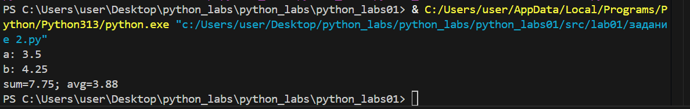

# Лабораторная работа №1
## Ввод/вывод и форматирование в Python

# Цель работы:
Освоить базовые операции ввода-вывода данных, работу с различными типами переменных и форматирование вывода в Python.

## Задание 1: Приветствие и возраст

**Файл:** `src/01_greeting.py`  

**Цель:** Работа со строками и целыми числами, конкатенация строк.

**Ввод:**
- Имя (строка)
- Возраст (целое число)

**Вывод:**

**Пример:**
Имя: Алиса
Возраст: 19
Привет, Алиса! Через год тебе будет 20.
# Задание 2: Сумма и среднее арифметическое

**Файл:** `src/02_sum_avg.py`  

**Цель:** Работа с вещественными числами, форматирование вывода.

**Ввод:**
- Два вещественных числа (поддерживаются точка и запятая)

**Вывод:**

**Пример:**
a: 3,5
b: 4.25
sum=7.75; avg=3.88   
**Задание 3**: Расчет чека со скидкой и НДС

**Файл:** `src/03_discount_vat.py`  

**Цель:** Применение математических формул, сложное форматирование вывода.

**Формулы:**
- `base = price * (1 - discount/100)`
- `vat_amount = base * (vat/100)`
- `total = base + vat_amount`

**Ввод:**
- Цена (вещественное)
- Скидка (%) (вещественное)
- НДС (%) (вещественное)

**Вывод:**

**Пример:**
price (₽): 1000
discount (%): 10
vat (%): 20
#   Задание 4: Конвертер минут в часы и минуты

**Файл:** `src/04_minutes_to_hhmm.py`  

**Цель:** Работа с целочисленным делением, форматирование времени.

**Ввод:**
- Минуты (целое число)

**Вывод:**

**Пример:**
Минуты: 135
2:15

#   Задание 5: Инициалы и длина строки

**Файл:** `src/05_initials_and_len.py`
 
**Цель:** Работа со строками, методами строк, форматирование.

**Ввод:**

 ФИО одной строкой (могут быть лишние пробелы)

**Вывод:**

**Пример:**

ФИО: Иванов Иван Иванович
Инициалы: ИИИ.
Длина (символов): 20

**Студент:** Никифорова Анастасия Сергеевна
**Группа:** [БИВТ-25-4]  
**Преподаватель:** [Жураковский К.В]
 
# Лабораторная работа №2
## Коллекции и матрицы (list/tuple/set/dict)
# Цель работы:
Освоить операции над списками, кортежами, множествами и словарями.
Научиться работать с 2D-списками (матрицами) — транспонирование, суммы по строкам/столбцам.
Аккуратно форматировать текстовые представления записей (на примере студента).

## Задание 1: arrays.py

**Файл:** `src/lab02/задание 1.1.py`  

**Цель:** Вернуть кортеж (минимум, максимум). Если список пуст — ValueError.

**Ввод в min_max:**
- [3, -1, 5, 5, 0]
- [42]
- [-5, -2, -9]
- []
- [1.5, 2, 2.0, -3.1]

**Вывод:**

**Файл:** `src/lab02/задание 1.2.py`

**Цель:** Вернуть отсортированный список уникальных значений (по возрастанию).

**Ввод в unique_sorted:**
- [3, 1, 2, 1, 3]
- []
- [-1, -1, 0, 2, 2]
- [1.0, 1, 2.5, 2.5, 0]

**Вывод:**

**Файл:** `src/lab02/задание 1.3.py`

**Цель:**«Расплющить» список списков/кортежей в один список по строкам (row-major). Если встретилась строка/элемент, который не является списком/кортежем — TypeError.

**Ввод в flatten:**
- [[1, 2], [3, 4]]
- [[1, 2], (3, 4, 5)]
- [[1], [], [2, 3]]
- [[1, 2], "ab"]

**Вывод:**

# Задание B: matrix.py

**Файл:** `src/lab02/задание B.1.py`

**Цель:** Поменять строки и столбцы местами. Пустая матрица [] → [].
Если матрица «рваная» (строки разной длины) — ValueError.
  

**Ввод в transpose:**
- [[1, 2, 3]]
- [[1], [2], [3]]
- [[1, 2], [3, 4]]
- []
- [[1, 2], [3]]

**Вывод:**

**Файл:** `src/lab02/задание B.2.py`

**Цель:** Сделать сумму по каждой строке. Требуется прямоугольность.

**Ввод в row_sums:**
- [[1, 2, 3], [4, 5, 6]]
- [[-1, 1], [10, -10]]
- [[0, 0], [0, 0]]
- [[1, 2], [3]]

**Вывод:**

**Файл:** `src/lab02/задание B.3.py`

**Цель:** сделать сумму по каждому столбцу. Требуется прямоугольность.

**Ввод в col_sums:**
- [[1, 2, 3], [4, 5, 6]]
- [[-1, 1], [10, -10]]
- [[0, 0], [0, 0]]
- [[1, 2], [3]]

**Вывод:**

#   Задание C: tuples.py

**Файл:** `src/lab02/задание C.1.py`  

**Цель:** Освоение работы с структурированными данными и форматированным выводом через кортежи.

**Ввод:**
- ("Иванов Иван Иванович", "BIVT-25", 4.6)
- ("Петров Пётр", "IKBO-12", 5.0)
- ("Петров Пётр Петрович", "IKBO-12", 5.0)
-  ("  сидорова  анна   сергеевна ", "ABB-01", 3.999)

**Вывод:**

**Студент:** Никифорова Анастасия Сергеевна
**Группа:** [БИВТ-25-4]  
**Преподаватель:** [Жураковский К.В]
